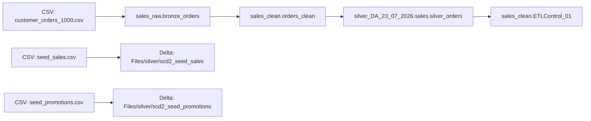

# Fabric Workspace Runbook

## Overview
This runbook describes the Fabric workspace artifacts present in `file-examples-com/` and the execution order for the sales lakehouse pipeline, notebooks, and supporting files.

The files represent a Fabric data engineering workspace for ingesting, transforming, and managing sales data through Bronze/Clean/Silver stages and SCD2 pipelines.

## Components

### Lakehouse artifacts
- `fabric06082026.Lakehouse/`
- `Silver_DA_23072026.Lakehouse/`
- `Silver_Sales_Fabric_Migration_2207.Lakehouse/`

### Notebooks
- `Practice_DA_2207.Notebook/`
- `Data_load_03082026.Notebook/`
- `OneLake_CSV_Pipeline.Notebook/`
- `SCD2_Sales_Pipeline.Notebook/`
- `seed_promotions_dataload.Notebook/`
- `DataQuality.Notebook/`

### Pipelines
- `SCD2_Sales_dataload.Pipeline/`
- `seed_promotions_dataload.Pipeline/`

### Dataflow
- `Dataflow_copilot_001_2707.Dataflow/`

### Environment and support files
- `Dinesh_Pyspark_practice_2207.Environment/`
- `ddls/`
- `dq/`

## Data flow and relationships

The primary data movement is:
- `customer_orders_1000.csv` → `sales_raw.bronze_orders`
- `sales_raw.bronze_orders` → `sales_clean.orders_clean`
- `sales_clean.orders_clean` → `silver_DA_23_07_2026.sales.silver_orders`
- `silver_DA_23_07_2026.sales.silver_orders` → `sales_clean.ETLControl_01`

Separate SCD2 historical artifacts:
- `seed_sales.csv` → Delta path `Files/silver/scd2_seed_sales`
- `seed_promotions.csv` → Delta path `Files/silver/scd2_seed_promotions`

### Mermaid relationship diagram

## Prerequisites

1. Access to the Fabric workspace containing the lakehouse item(s).
2. Permissions to run Fabric notebooks and pipelines.
3. Source files uploaded to the Fabric Lakehouse `Files` folder, including:
   - `customer_orders_1000.csv`
   - `seed_sales.csv`
   - `seed_promotions.csv`
4. If using local Git artifacts, ensure the Fabric item structure is mapped to these folder names.

## Execution steps

### 1. Validate the Fabric lakehouse item
- Confirm the target lakehouse item exists in Fabric.
- If the lakehouse item is `af71501d-67b1-4679-9f9d-581ee440eac3`, map the local folders to that lakehouse.
- Review lakehouse metadata files:
  - `Silver_DA_23072026.Lakehouse/lakehouse.metadata.json`
  - `Silver_Sales_Fabric_Migration_2207.Lakehouse/lakehouse.metadata.json`

### 2. Run the core transformation notebook
- Open `Practice_DA_2207.Notebook/notebook-content.py` in Fabric.
- Execute the notebook cells in order.
- This notebook builds:
  - `sales_raw.bronze_orders`
  - `sales_clean.orders_clean`
  - `silver_DA_23_07_2026.sales.silver_orders`
  - `sales_clean.ETLControl_01`

### 3. Run the SCD2 sales pipeline
- Open and run `SCD2_Sales_Pipeline.Notebook/notebook-content.py`.
- Or execute the pipeline definition in `SCD2_Sales_dataload.Pipeline/pipeline.json`.
- This pipeline reads `seed_sales.csv` and writes SCD2 history data to `Files/silver/scd2_seed_sales`.

### 4. Run the promotions SCD2 pipeline
- Open and run `seed_promotions_dataload.Notebook/notebook-content.py`.
- Or execute the pipeline definition in `seed_promotions_dataload.Pipeline/pipeline.json`.
- This pipeline reads `seed_promotions.csv` and writes history data to `Files/silver/scd2_seed_promotions`.

### 5. Optional data quality checks
- Use `DataQuality.Notebook/` and `dq/` definitions to validate data.
- The `dq/dq_checks.json` file contains sample checks for `order_id`, `amount`, and null thresholds.

### 6. Optional DDL/schema setup
- Use `Data_load_03082026.Notebook/` to execute DDL files from `ddls/`.
- The DDL folder includes schema creation SQL for `fabric_data_load_03082026`.

## Validation checks

Run these queries after execution:

- `SELECT COUNT(*) FROM sales_raw.bronze_orders;`
- `SELECT COUNT(*) FROM sales_clean.orders_clean;`
- `SELECT COUNT(*) FROM silver_DA_23_07_2026.sales.silver_orders;`
- `SELECT * FROM sales_clean.ETLControl_01 ORDER BY count_timestamp DESC LIMIT 20;`
- `SELECT COUNT(*) FROM delta.`"Files/silver/scd2_seed_sales";`
- `SELECT COUNT(*) FROM delta.`"Files/silver/scd2_seed_promotions";`

## Metadata and housekeeping

- `Silver_DA_23072026.Lakehouse/lakehouse.metadata.json` currently contains only `{"defaultSchema":"dbo"}`.
- `Silver_Sales_Fabric_Migration_2207.Lakehouse/lakehouse.metadata.json` is empty and should be populated with display name, description, owners, and tags.
- `shortcuts.metadata.json` files are empty; add shortcuts if source data is stored externally.

## Troubleshooting

- If a notebook fails due to missing files, confirm the source CSVs exist in the lakehouse `Files` folder.
- If table writes fail, verify the Fabric lakehouse has the required default schema and write permissions.
- If pipeline execution fails, inspect the pipeline activity logs for notebook errors and delta path permissions.

## Notes

- The workspace structure is local to `file-examples-com/`.
- This runbook is inferred from notebook code and local metadata, not from the live Fabric environment.
- Use the Mermaid diagram as the basis for documenting the dataset relationship across lakehouse stages.
